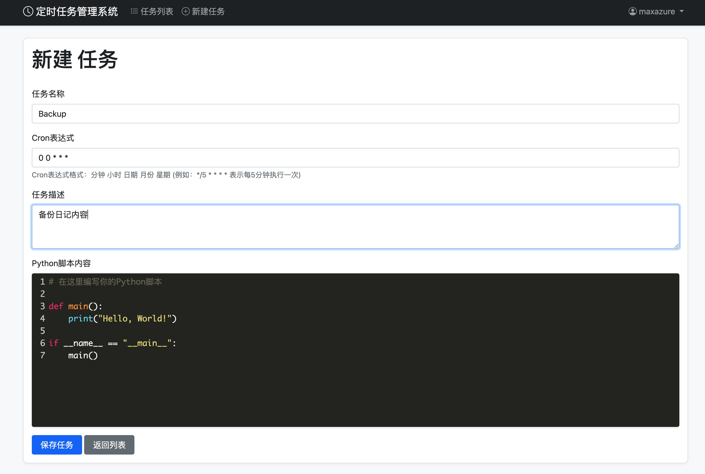

# Flask 定时任务管理系统

## flask-cron-manager

一个基于 Flask 的 Web 应用程序，用于管理和调度 Python 定时任务。

## 截图




## 功能特点

- 通过 Web 界面管理定时任务
- 支持 Cron 表达式设置任务执行时间
- 在线编辑 Python 脚本（支持语法高亮）
- 自动同步系统 Crontab
- 响应式界面设计

## 技术栈

- Flask - Web 框架
- SQLAlchemy - ORM
- Python-Crontab - Crontab 管理
- Bootstrap 5 - 前端框架
- CodeMirror - 代码编辑器

## 安装说明

1. 克隆仓库：

```bash
git clone https://github.com/maxazure/flask-cron-manager.git
cd flask-cron-manager
```

2. 创建虚拟环境：

```bash
python -m venv venv
source venv/bin/activate  # Linux/Mac
# 或
venv\Scripts\activate  # Windows
```

3. 安装依赖：

```bash
pip install -r requirements.txt
```

4. 初始化数据库：

```bash
python app.py
```

应用将自动创建数据库和必要的表。

## 使用说明

1. 启动应用：

应用支持以下命令行参数：

```bash
python app.py [选项]
```

选项说明：
- `--host`: 指定监听的主机地址（默认：127.0.0.1）
- `--port`: 指定监听的端口（默认：5000）
- `--debug`: 启用调试模式（可选）

示例：
```bash
# 使用默认配置启动
python app.py

# 指定主机和端口
python app.py --host 0.0.0.0 --port 8989

# 启用调试模式
python app.py --host 0.0.0.0 --port 8989 --debug
```

2. 在浏览器中访问对应的地址（例如：http://localhost:8989）

## 定时任务管理

### 创建新任务

1. 点击"新建任务"按钮
2. 填写任务信息：
   - 任务名称
   - Cron 表达式
   - 任务描述
   - Python 脚本内容
3. 点击"保存任务"

### Cron 表达式示例

- `*/5 * * * *` - 每5分钟执行一次
- `0 * * * *` - 每小时执行一次
- `0 0 * * *` - 每天零点执行一次
- `0 0 * * 0` - 每周日零点执行一次
- `0 0 1 * *` - 每月1日零点执行一次

## 安全注意事项

1. 确保只有授权用户可以访问系统
2. 定期检查和审核任务脚本
3. 建议在生产环境中启用用户认证
4. 定期备份数据库

## 目录结构

```
flask-task-scheduler/
├── app.py              # 主应用文件
├── requirements.txt    # 依赖包列表
├── static/            # 静态文件
│   └── css/
│       └── style.css  # 自定义样式
├── templates/         # 模板文件
│   ├── base.html     # 基础模板
│   ├── index.html    # 任务列表页
│   └── task_form.html # 任务表单页
└── scripts/          # 任务脚本目录
```

## 贡献指南

欢迎提交 Issue 和 Pull Request。

## 许可证

MIT License